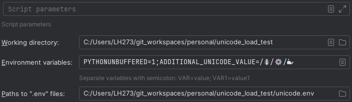

run config

````env
# unicode.env
UNICODE_VALUE=/🐜/⚙️/🐳
NOT_UNICODE_VALUE=/this/is/plain/text
````
expected output: ( broken )
````log
comparison with unicode value loaded from .env file
expected_value: /🐜/⚙️/🐳
loaded_value: /�/⚙�/�
expected_unicode_value == loaded_unicode_value: False
expected bytes: <b'/\xf0\x9f\x90\x9c/\xe2\x9a\x99\xef\xb8\x8f/\xf0\x9f\x90\xb3'> loaded bytes <b'/\xc3\xb0\xc5\xb8\xef\xbf\xbd\xc5\x93/\xc3\xa2\xc5\xa1\xe2\x84\xa2\xc3\xaf\xc2\xb8\xef\xbf\xbd/\xc3\xb0\xc5\xb8\xef\xbf\xbd\xc2\xb3'>
********************************************************************************
comparison with unicode value loaded from environment config
expected_value: /🐜/⚙️/🐳
loaded_value: /🐜/⚙️/🐳
expected_unicode_value == loaded_unicode_value: True
expected bytes: <b'/\xf0\x9f\x90\x9c/\xe2\x9a\x99\xef\xb8\x8f/\xf0\x9f\x90\xb3'> loaded bytes <b'/\xf0\x9f\x90\x9c/\xe2\x9a\x99\xef\xb8\x8f/\xf0\x9f\x90\xb3'>
********************************************************************************
comparison with not unicode value loaded from .env file
expected_value: /this/is/plain/text
loaded_value: /this/is/plain/text
expected_unicode_value == loaded_unicode_value: True
expected bytes: <b'/this/is/plain/text'> loaded bytes <b'/this/is/plain/text'>

````


PY-241.14494.241, JRE 17.0.10+8-b1207.12x64 JetBrains s.r.o., OS Windows 11(amd64) v10.0 , screens 4608.0x2880.0, 2560.0x1440.0, 2560.0x1440.0
Auto-uploaded logs URL (accessible to JetBrains employees only): https://uploads.jetbrains.com/browse#2024_04_05_JwUrGMeMZ2bfaNDeR4irzW